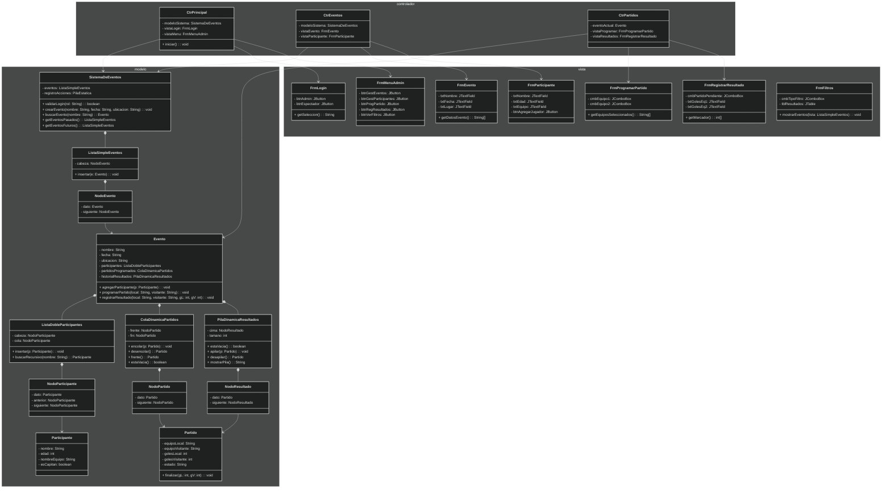

# 1. Grupo e Integrantes

Grupo: E

Integrantes:

- Luis Daniel Jaen Vargas  
- José Valentín Medrano Páramo  
- Steven Alonso Fallas Madrigal  
- Ireany Sevilla Araya

---

# 2. Plan de Proyecto con Responsables por Tarea

El proyecto se estará trabajando en grupo, de manera organizada, asignando diferentes responsabilidades a cada compañero (a), para así de esta forma, poder tener una buena gestión del proyecto, que todo sea equitativo y que se pueda realizar un buen trabajo en conjunto.

---

# 3. Introducción

Este proyecto consiste en el desarrollo de un sistema para la gestión de eventos deportivos, utilizando las estructuras vistas en clase.

El sistema será desarrollado en Java usando el patrón Modelo–Vista–Controlador (MVC), lo que permitirá poner en práctica los conceptos teóricos y prácticos vistos en clases, mediante una aplicación funcional.

¿Qué es MVC?
El patrón Modelo-Vista-Controlador (MVC) separa la lógica de negocio (Modelo), la presentación (Vista) y la interacción del usuario (Controlador), lo cual facilita el mantenimiento y la escalabilidad de las aplicaciones (Arquitectura Java, 2026).

---

# 4. Roles del Equipo

| Integrante | Rol |
|------------|------|
| Luis Daniel Jaén Vargas | Documentación y apoyo en estructuras de datos |
| José Valentín Medrano Páramo | Componentes visuales y librerías |
| Steven Alonso Fallas Madrigal | Diagrama de clases y funcionalidad de colas y pilas |
| Ireany Sevilla Araya | Diseño de menú e interfaces de usuario |

**Responsabilidad compartida:**  
Todos los integrantes participarán en la integración del sistema, pruebas, corrección de errores y también, en el trabajo en equipo para los entregables del presente proyecto.

---

### Funcionamiento de Pilas y Colas en el Sistema

Para gestionar los datos, dividimos el uso de estructuras en dos tipos según la necesidad de memoria: dinámicas  y estáticas.

#### 1. Estructuras Dinámicas (Basadas en Nodos)
Las usamos para los partidos del evento porque es imposible predecir cuántos juegos habrá. Si usáramos un arreglo fijo de 50 espacios y se juegan 51, el programa fallaría. Con nodos, la memoria crece y se reduce exactamente según lo que el evento necesite.

* **ColaDinamicaPartidos (Calendario):** Funciona con lógica **FIFO** (Primero en entrar, primero en salir). Nos garantiza un orden cronológico estricto: el primer partido que programamos es el primero en la lista para jugarse.
* **PilaDinamicaResultados (Historial):** Funciona con lógica **LIFO** (Último en entrar, primero en salir). La rúbrica pide mostrar los resultados más recientes de primero. Al usar una pila, el último resultado registrado queda en la cima, permitiéndonos mostrar los datos más nuevos de forma instantánea sin tener que programar algoritmos pesados para ordenarlos.

#### 2. Estructuras Estáticas (Basadas en Arreglos)
Las usamos exclusivamente para tareas de control interno del sistema donde **sí** necesitamos poner un límite estricto de memoria para que la aplicación no se sature.

* **PilaEstatica (Registro de acciones):** Funciona como un historial de las últimas acciones del administrador. Al usar un tamaño estricto (ej. 10 acciones), evitamos que un historial infinito consuma toda la memoria RAM de la computadora.
* **ColaEstatica (Cola de reportes/impresión):** Se encarga de encolar tareas cortas del sistema. Al ponerle un tamaño máximo, prevenimos que el sistema se pegue o sature si el usuario hace demasiadas peticiones al mismo tiempo.

# 5. Imágenes del diseño
1-

2-

3-

4-

5-

6-

7-

8-

9-

10-

11-

12-

## Referencias
Arquitectura Java. (2026). ¿Qué es el Patrón MVC? Recuperado de https://www.arquitecturajava.com/el-modelo-vista-controlador-y-sus-responsabilidades/#%C2%BFQue_es_el_Patron_MVC
